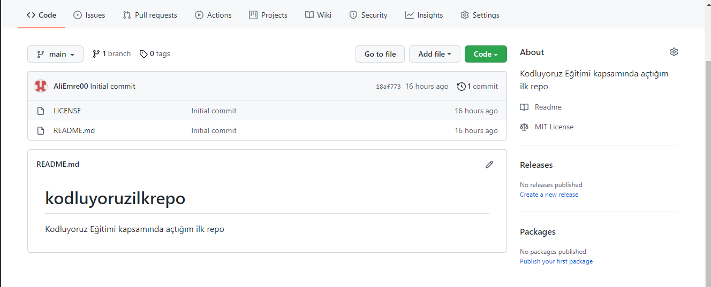

# kodluyoruzilkrepo
Kodluyoruz Eğitimi kapsamında [Patika'da] (https://app.patika.dev/egitimler) açtığım ilk repo. İçinde bir adet README dosyası, bir adet index.html dosyası bulunuyor.

# Installation
öncelikle projeyi clonelayın.

>git clone https://github.com/AliEmre00/kodluyoruzilkrepo

# Usage
Projeyi cloneladıktan sonra Visual Studio Code programında açınız.

Linux için:
> cd kodluyorzilkrepo
>
>code .

# Contributing

Pull requestler kabul edilir. Büyük değişiklikler için önce neyi değiştirmek istediğinizi tartışmak için konu açınız.

# License

[License](https://github.com/AliEmre00/kodluyoruzilkrepo/blob/main/LICENSE)